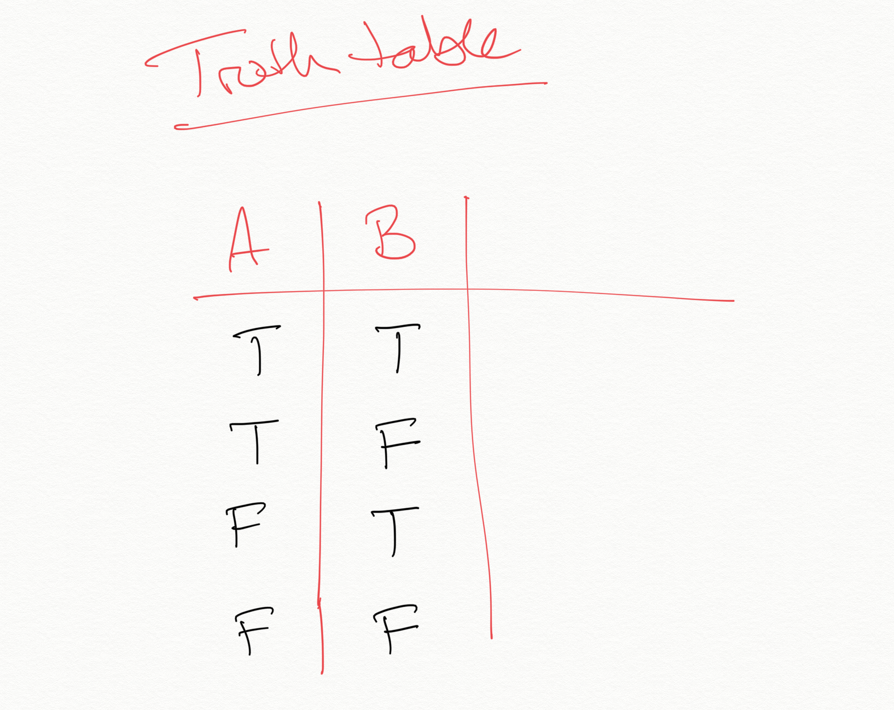
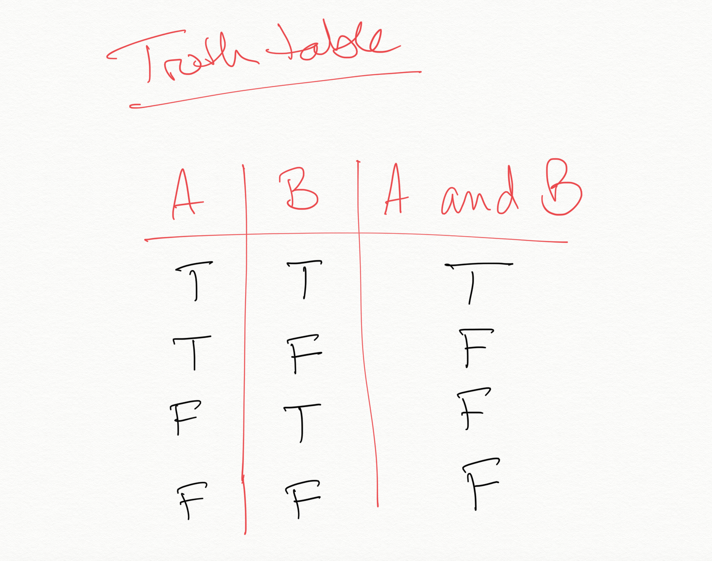
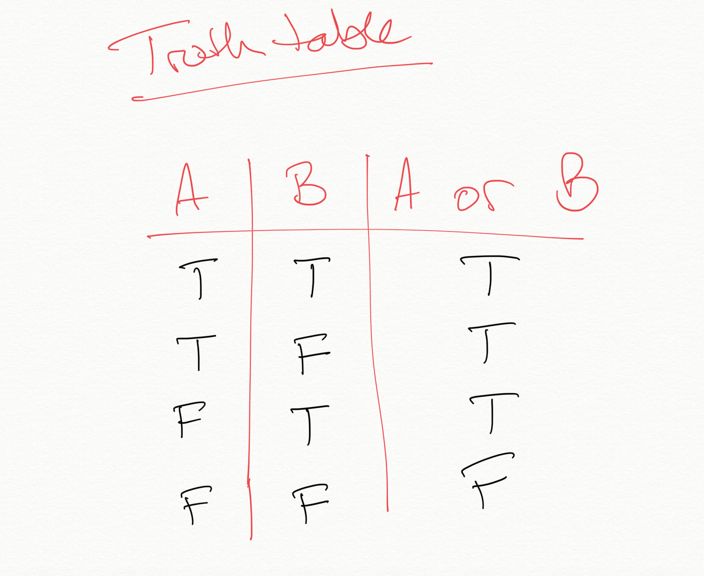
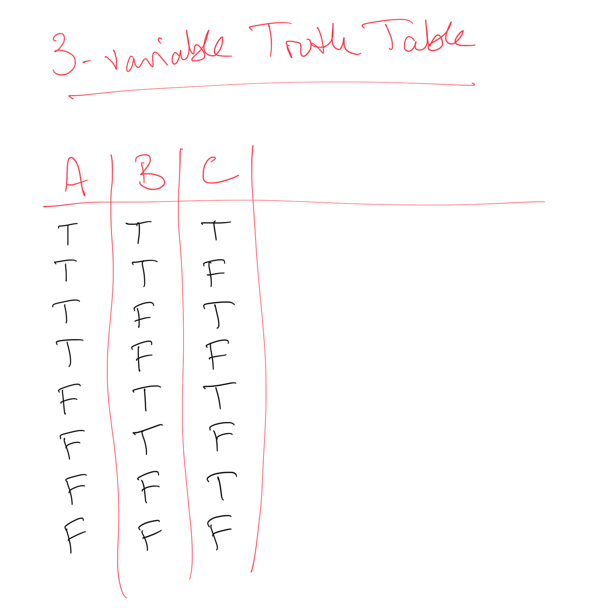
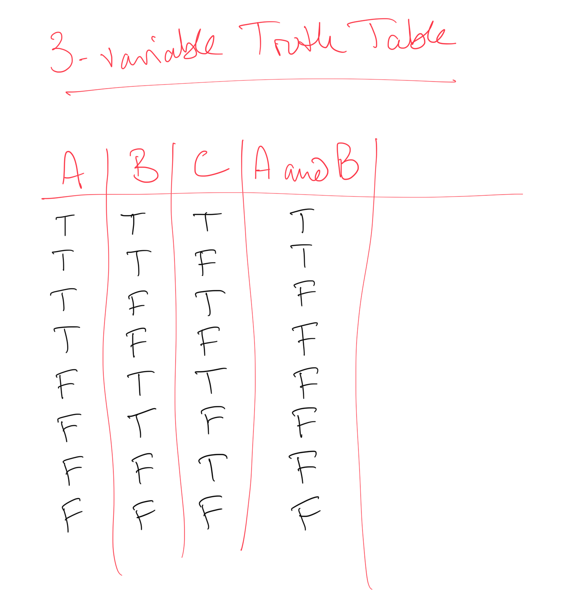
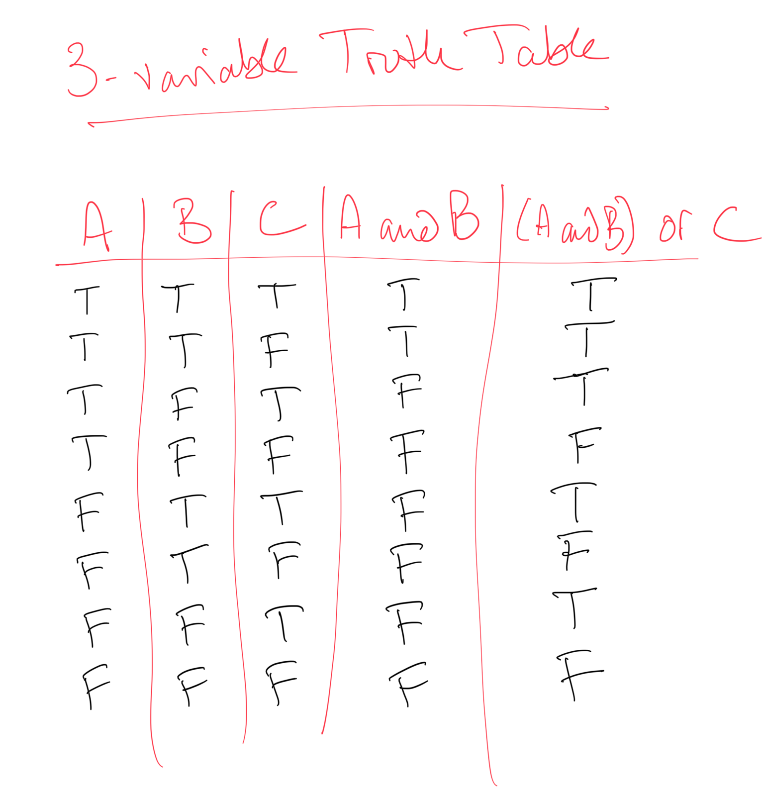

# 011 Python data types : Answers to exercises

#### Exercise 1

* If the ASCII code for `e` is `101` and the code for `n` is `110`, what is the code for `a`?


```python
# ANSWER
msg = '''
e -> 101
n -> 110

since e is the 5th letter of the alphabet and n is the 14th
it follows that a is 101 - 4 == 110 - 13 = 97

so

a -> 97

Confirm this e.g. on http://www.asciitable.com/
'''
print(msg)
```

    
    e -> 101
    n -> 110
    
    since e is the 5th letter of the alphabet and n is the 14th
    it follows that a is 101 - 4 == 110 - 13 = 97
    
    so
    
    a -> 97
    
    Confirm this e.g. on http://www.asciitable.com/
    


#### Exercise 2

* in a code cell below, create a variable called `name` and set it to your name
* print the string name, and its length
* comment on why the length is the value you find


```python
# ANSWER

# in a code cell below, create a variable called `name` and set it to your name
name = 'Charlie Walker'

# print the string name, and its length
print(name,len(name))

# comment on why the length is the value you find
msg = '''
    The string 'Charlie' has 7 characters
    the string 'Walker' has 6 characters
    plus we have a space iun the middle
    so, the length we would expect is 7 + 6 + 1 = 14

    This is what is returned by len(name)
'''
print(msg)
```

    Charlie Walker 14
    
        The string 'Charlie' has 7 characters
        the string 'Walker' has 6 characters
        plus we have a space iun the middle
        so, the length we would expect is 7 + 6 + 1 = 14
    
        This is what is returned by len(name)
    


#### Answer

We could find this by examining ASCII code [tables](http://www.asciitable.com) and see that `a` (lower case a) has the code 97.

Alternatively, we could search for help on this topic, and find that the python function `ord()` converts from string to ASCII code: 


```python
# ANSWER
print("the ASCII code for 'a' is",ord('a'))
```

    the ASCII code for 'a' is 97


Alternatively, we might notice that `n` is the 14th letter of the alphabet, and `e`the 5th, so the code seems to be `97 + N` where `N` is the order the letter appears in the alphabet. We can confirm this with the 15th letter `o` which we see from above has the code `111`. 

#### Exercise 3

* insert a new cell below here
* set a variable called message to contain the string `hello world`
* print the value and data type of the variable message


```python
# ANSWER

# set a variable called message to contain the string hello world
message = 'hello world'

# print the value and data type of the variable message
print(message,type(message))
```

    hello world <class 'str'>


#### Exercise 4

Since the energy level expressed in $J$ is quite small, we might more conveniently express it in units of eV. Given that:

$$
    1\ Electron\ volt\ (eV) = 1.602176565 \times 10^{-19} J
$$

* Insert a new cell below here
* calculate the energy associated with a blue photon at 450 nm, in eV
* confirm your answer using a [web calculator](http://www.calctool.org/CALC/other/converters/e_of_photon)


```python
# Answer
# Copy mostly from above:

# values of c and h
c = 2.99792458e8
h = 6.62607015e-34

print(h * c)
# wavelength in nm: BLUE
# calculate the energy associated with a blue photon at 450 nm, in eV
l_nm = 450.0

# wavelength in m
l_m = l_nm * 1e-9

# Planck-Einstein in J
E_J = h * c / l_m

# conversion formula given above
E_eV = E_J / 1.602176565e-19
print('Photon of wavelength', l_nm, 'nm')
print('has an energy of', E_eV, 'eV')
# which compares with 2.75520 eV given in the web calculator
```

    1.9864458571489286e-25
    Photon of wavelength 450.0 nm
    has an energy of 2.7552045282834468 eV


#### Exercise 5

* insert a new cell below here
* using integer arithmetic, print the result of:
  - 2 to the power of 8
  - 1024 divided by 2
* set a variable called `x` to the result of 7 (floor) divided by 3.
  - print the value of `x`, and confirm its data type is `int`


```python
#
# answer
# using integer arithmetic, print the result of:

# 2 to the power of 8
print(2**8)

# 1024 divided by 2 integer division (floor)
print(1024 // 2)

# set a variable called x to the result of 7 divided by 3
x = 7 // 3
print('Integer: 7 divided by 3 is', x, type(x))

# We contrast this with the use of /
# which results in a variable of type float
x = 7 / 3
print('7 divided by 3 is', x, type(x))
```

    256
    512
    Integer: 7 divided by 3 is 2 <class 'int'>
    7 divided by 3 is 2.3333333333333335 <class 'float'>


#### Exercise 6

* Insert a new cell below here
* Set a variable called `is_class_today` to the value `True`
* print the variable name, its value, and its data type


```python
# ANSWER
# Insert a new cell below here
# Set a variable called `is_class_today` to the value `True`

is_class_today = True

# print the variable name, its value, and its data type

print('is_class_today',is_class_today,type(is_class_today))
```

    is_class_today True <class 'bool'>


#### Exercise 7
   
* Insert a new cell below here
* write a statement to set a variable `x` to `True` and print the value of `x` and `not x` 
* what does `not not x` give? Make sure you understand why 


```python
# ANSWER

# write a statement to set a variable x to True 
x = True

# and print the value of x and not x
print('x is',x)
print('not x is',not x)

# what does not not x give? 
print('not not x is',not not x)
msg = '''
answer
------
not not x is the same as just x

A double negative cancels out, in effect
'''
print(msg)
```

    x is True
    not x is False
    not not x is True
    
    answer
    ------
    not not x is the same as just x
    
    A double negative cancels out, in effect
    


```python
# ANSWER
# do the testing here e.g.
print (True or False)
```

    True


| blank  | A and B  | A or B  | 
|:---:|:---:|:---:|
|   |   |   | 


#### Exercise 9

* Copy the 3 variable truth table from above onto paper 
* fill out a column with `A and B`
* fill out a column with `((A and B) or C) `
* Try some other compound statements

If you are unsure, or to check your answers, test the response using code, below.


```python
# ANSWER
# do the testing here e.g.
print ((True and False) or True)
```

    True


| blank  | A and B  | ((A and B) or C) | 
|:---:|:---:|:---:|
|   |   |   | 


```python
# ANSWER

# write a statement to set a variable x to True a
x = True

# print the value of x 
print('x is',x)

# print the value of not x 
print('not x is',not x)

# what does not not x give?
print('not not x is',not not x)
# not not cancels out (double negative)
```

    x is True
    not x is False
    not not x is True


```python
# ANSWER

# Set a variable called `is_class_today` to the value `True`
is_class_today = True

# print the variable name, its value, and its data type
print('is_class_today',is_class_today,type(is_class_today))
```

    is_class_today True <class 'bool'>


#### Exercise 10

* insert a new cell below here
* copy the code in the cell above, set `start_number` to `0`, and run
    * What are the boolean representations of `0` and `1`?
* What would happen if you set `start_number` to the string `'zero'`, and why?


```python
# ANSWER

# copy the code in the cell above, and set start_number to 0
start_number = 0

print("starting with", start_number)
int_number = int(start_number)
print('int_number', int_number, type(int_number))
# now convert to float
float_number = float(int_number)
print('float_number', float_number, type(float_number))
# now convert to str
str_number = str(int_number)
print('str_number', str_number, type(str_number))
# now convert to bool
bool_number = bool(int_number)
print('bool_number', bool_number, type(bool_number))

# What is the boolean representation of 0?
msg = '''

What would happen if you set start_number to the string 'zero', and why?

Answer
------
  1 -> True
  0 -> False

  If we set start_number to 'zero' then int('zero') will fail
  because it cannot convert a word representation of this sort to an integer
  only a character representation such as '0' or '1'
'''
print(msg)
```

    starting with 0
    int_number 0 <class 'int'>
    float_number 0.0 <class 'float'>
    str_number 0 <class 'str'>
    bool_number False <class 'bool'>
    
    
    What would happen if you set start_number to the string 'zero', and why?
    
    Answer
    ------
      1 -> True
      0 -> False
    
      If we set start_number to 'zero' then int('zero') will fail
      because it cannot convert a word representation of this sort to an integer
      only a character representation such as '0' or '1'
    

